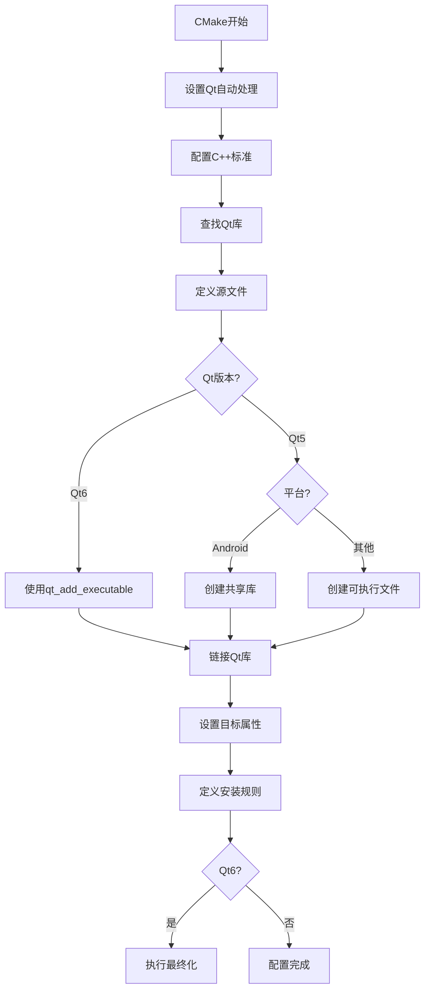

# 一个CMakeLists.txt例子详解

```cmake
cmake_minimum_required(VERSION 3.16)

project(untitled3 VERSION 0.1 LANGUAGES CXX)

set(CMAKE_AUTOUIC ON)
set(CMAKE_AUTOMOC ON)
set(CMAKE_AUTORCC ON)

set(CMAKE_CXX_STANDARD 17)
set(CMAKE_CXX_STANDARD_REQUIRED ON)

find_package(QT NAMES Qt6 Qt5 REQUIRED COMPONENTS Widgets)
find_package(Qt${QT_VERSION_MAJOR} REQUIRED COMPONENTS Widgets)

set(PROJECT_SOURCES
        main.cpp
        mainwindow.cpp
        mainwindow.h
        mainwindow.ui
)

if(${QT_VERSION_MAJOR} GREATER_EQUAL 6)
    qt_add_executable(untitled3
        MANUAL_FINALIZATION
        ${PROJECT_SOURCES}
    )
# Define target properties for Android with Qt 6 as:
#    set_property(TARGET untitled3 APPEND PROPERTY QT_ANDROID_PACKAGE_SOURCE_DIR
#                 ${CMAKE_CURRENT_SOURCE_DIR}/android)
# For more information, see https://doc.qt.io/qt-6/qt-add-executable.html#target-creation
else()
    if(ANDROID)
        add_library(untitled3 SHARED
            ${PROJECT_SOURCES}
        )
# Define properties for Android with Qt 5 after find_package() calls as:
#    set(ANDROID_PACKAGE_SOURCE_DIR "${CMAKE_CURRENT_SOURCE_DIR}/android")
    else()
        add_executable(untitled3
            ${PROJECT_SOURCES}
        )
    endif()
endif()

target_link_libraries(untitled3 PRIVATE Qt${QT_VERSION_MAJOR}::Widgets)

# Qt for iOS sets MACOSX_BUNDLE_GUI_IDENTIFIER automatically since Qt 6.1.
# If you are developing for iOS or macOS you should consider setting an
# explicit, fixed bundle identifier manually though.
if(${QT_VERSION} VERSION_LESS 6.1.0)
  set(BUNDLE_ID_OPTION MACOSX_BUNDLE_GUI_IDENTIFIER com.example.untitled3)
endif()
set_target_properties(untitled3 PROPERTIES
    ${BUNDLE_ID_OPTION}
    MACOSX_BUNDLE_BUNDLE_VERSION ${PROJECT_VERSION}
    MACOSX_BUNDLE_SHORT_VERSION_STRING ${PROJECT_VERSION_MAJOR}.${PROJECT_VERSION_MINOR}
    MACOSX_BUNDLE TRUE
    WIN32_EXECUTABLE TRUE
)

include(GNUInstallDirs)
install(TARGETS untitled3
    BUNDLE DESTINATION .
    LIBRARY DESTINATION ${CMAKE_INSTALL_LIBDIR}
    RUNTIME DESTINATION ${CMAKE_INSTALL_BINDIR}
)

if(QT_VERSION_MAJOR EQUAL 6)
    qt_finalize_executable(untitled3)
endif()

```

这个 CMakeLists.txt 文件配置了一个 Qt GUI 应用程序项目，支持 Qt5 和 Qt6 双版本。下面我将逐部分详细解释其内容和功能：

```cmake
cmake_minimum_required(VERSION 3.16)
```
- **作用**：指定 CMake 的最低版本要求为 3.16
- **原因**：确保使用的 CMake 功能在指定版本以上可用
- **最佳实践**：总是放在 CMakeLists.txt 的开头

```cmake
project(untitled3 VERSION 0.1 LANGUAGES CXX)
```
- **作用**：定义项目名称为 "untitled3"，版本号为 0.1，使用 C++ 语言
- **关键参数**：
  - `VERSION 0.1`：设置项目版本
  - `LANGUAGES CXX`：指定项目使用 C++ 语言

```cmake
set(CMAKE_AUTOUIC ON)
set(CMAKE_AUTOMOC ON)
set(CMAKE_AUTORCC ON)
```
- **作用**：启用 Qt 的自动处理功能
- **详细说明**：
  - `AUTOMOC ON`：自动处理 Qt 的元对象系统（moc）
  - `AUTOUIC ON`：自动处理 Qt 的 UI 文件（.ui）
  - `AUTORCC ON`：自动处理 Qt 的资源文件（.qrc）
- **优势**：简化 Qt 项目的构建流程，无需手动调用 moc/uic/rcc

```cmake
set(CMAKE_CXX_STANDARD 17)
set(CMAKE_CXX_STANDARD_REQUIRED ON)
```
- **作用**：配置 C++ 语言标准
- **详细说明**：
  - 要求使用 C++17 标准
  - `REQUIRED ON` 表示如果编译器不支持 C++17 则报错

```cmake
find_package(QT NAMES Qt6 Qt5 REQUIRED COMPONENTS Widgets)
find_package(Qt${QT_VERSION_MAJOR} REQUIRED COMPONENTS Widgets)
```
- **作用**：查找并加载 Qt 库
- **详细说明**：
  1. 优先查找 Qt6，如果找不到则查找 Qt5
  2. `REQUIRED` 表示必须找到，否则配置失败
  3. `COMPONENTS Widgets` 指定需要 Qt Widgets 模块
  4. 第二行根据找到的 Qt 主版本再次查找对应版本

```cmake
set(PROJECT_SOURCES
        main.cpp
        mainwindow.cpp
        mainwindow.h
        mainwindow.ui
)
```
- **作用**：定义项目源文件列表
- **包含内容**：
  - 实现文件 (.cpp)
  - 头文件 (.h)
  - Qt UI 文件 (.ui)
- **注意**：通常资源文件 (.qrc) 也应包含在此列表

```cmake
if(${QT_VERSION_MAJOR} GREATER_EQUAL 6)
    qt_add_executable(untitled3
        MANUAL_FINALIZATION
        ${PROJECT_SOURCES}
    )
else()
    if(ANDROID)
        add_library(untitled3 SHARED
            ${PROJECT_SOURCES}
        )
    else()
        add_executable(untitled3
            ${PROJECT_SOURCES}
        )
    endif()
endif()
```
- **作用**：创建可执行目标，处理 Qt5/Qt6 差异
- **详细说明**：
  - **Qt6+**：使用 `qt_add_executable()`（Qt 提供的增强函数）
    - `MANUAL_FINALIZATION`：延迟最终配置，允许后续修改目标属性
  - **Qt5**：
    - **Android**：创建共享库（Android 应用的特殊要求）
    - **其他平台**：创建标准可执行文件

```cmake
target_link_libraries(untitled3 PRIVATE Qt${QT_VERSION_MAJOR}::Widgets)
```
- **作用**：链接 Qt Widgets 库到可执行目标
- **关键参数**：
  - `PRIVATE`：依赖关系仅作用于当前目标
  - `QtX::Widgets`：根据版本链接 Qt5/6 Widgets 模块

```cmake
if(${QT_VERSION} VERSION_LESS 6.1.0)
  set(BUNDLE_ID_OPTION MACOSX_BUNDLE_GUI_IDENTIFIER com.example.untitled3)
endif()
```
- **作用**：处理 macOS 应用的 Bundle 标识符
- **详细说明**：
  - Qt 6.1+ 自动设置 Bundle ID
  - 旧版本需要手动设置
  - `com.example.untitled3` 是默认 ID，实际项目应修改

```cmake
set_target_properties(untitled3 PROPERTIES
    ${BUNDLE_ID_OPTION}
    MACOSX_BUNDLE_BUNDLE_VERSION ${PROJECT_VERSION}
    MACOSX_BUNDLE_SHORT_VERSION_STRING ${PROJECT_VERSION_MAJOR}.${PROJECT_VERSION_MINOR}
    MACOSX_BUNDLE TRUE
    WIN32_EXECUTABLE TRUE
)
```
- **作用**：设置目标属性，主要针对 macOS 和 Windows
- **属性详解**：
  - `MACOSX_BUNDLE`：标记为 macOS 应用包
  - `MACOSX_BUNDLE_BUNDLE_VERSION`：设置应用版本
  - `MACOSX_BUNDLE_SHORT_VERSION_STRING`：设置短版本号
  - `WIN32_EXECUTABLE`：Windows 下创建 GUI 应用（无控制台窗口）

```cmake
include(GNUInstallDirs)
install(TARGETS untitled3
    BUNDLE DESTINATION .
    LIBRARY DESTINATION ${CMAKE_INSTALL_LIBDIR}
    RUNTIME DESTINATION ${CMAKE_INSTALL_BINDIR}
)
```
- **作用**：定义安装规则
- **详细说明**：
  - `include(GNUInstallDirs)`：包含标准安装目录定义
  - 安装目标到不同位置：
    - `BUNDLE`：macOS 应用包安装到当前目录
    - `LIBRARY`：库文件安装到标准库目录
    - `RUNTIME`：可执行文件安装到 bin 目录

```cmake
if(QT_VERSION_MAJOR EQUAL 6)
    qt_finalize_executable(untitled3)
endif()
```
- **作用**：完成 Qt6 可执行目标的最终配置
- **详细说明**：
  - 与前面的 `MANUAL_FINALIZATION` 对应
  - 执行 Qt 特定的最终处理步骤

## 整体工作流程



## 关键特性总结

1. **Qt版本兼容**：
   - 同时支持 Qt5 和 Qt6
   - 自动检测并使用合适版本

2. **跨平台支持**：
   - 处理 macOS、Windows 和 Android 的差异
   - 自动配置平台特定属性

3. **现代CMake实践**：
   - 使用目标属性代替全局变量
   - 清晰的依赖关系管理
   - 标准化的安装规则

4. **自动化处理**：
   - 自动处理 Qt 的 moc/uic/rcc
   - 简化项目配置

5. **可扩展结构**：
   - 清晰的逻辑分支
   - 易于添加新模块和功能

## 改进建议

1. **添加资源文件支持**：
   ```cmake
   # 添加资源文件
   set(RESOURCES resources.qrc)
   qt_add_resources(untitled3_RESOURCES ${RESOURCES})
   target_sources(untitled3 PRIVATE ${untitled3_RESOURCES})
   ```

2. **添加翻译支持**：
   ```cmake
   # 添加翻译文件
   set(TS_FILES translations/untitled3_en.ts translations/untitled3_zh.ts)
   qt_add_translations(untitled3 TS_FILES ${TS_FILES})
   ```

3. **添加更多组件支持**：
   ```cmake
   # 查找并添加更多Qt模块
   find_package(Qt${QT_VERSION_MAJOR} REQUIRED COMPONENTS 
       Widgets
       Network
       Sql
   )
   target_link_libraries(untitled3 PRIVATE 
       Qt${QT_VERSION_MAJOR}::Widgets
       Qt${QT_VERSION_MAJOR}::Network
       Qt${QT_VERSION_MAJOR}::Sql
   )
   ```

4. **添加安装后处理**：
   ```cmake
   # 安装后复制依赖库
   install(CODE "
       include(BundleUtilities)
       fixup_bundle(\"${CMAKE_INSTALL_PREFIX}/bin/untitled3\" \"\" \"\")
   " COMPONENT Runtime)
   ```

这个 CMakeLists.txt 文件展示了一个现代 Qt 应用程序的标准配置，遵循了 Qt 官方推荐的最佳实践，具有良好的可维护性和跨平台兼容性。